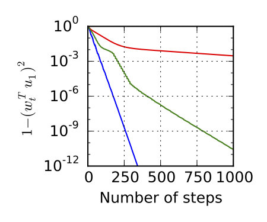

# Stochastic Power Iteration with Momentum

This repository contains the Julia code that produces all the experimental results in the paper [Accelerated Stochastic Power Iteration](http://arxiv.org/abs/1707.02670).

## Usage
The main code of the implementation for different PCA algorithms is in the file <code>[eigensolvers.jl](./eigensolvers.jl)</code>.

 - <code>minibatch_sgd_m(data, x, beta, iters, u, s, seed=1)</code>: This function is the implementation for our algorithm *Mini-batch Power Method with Momentum*. `data` is the data matrix where eacho row represents a single point, `x` is the initial point, `beta` is the momentum parameter, `iters` is the maximum number of iterations, `u` is the true eigenvector that is used to compute the error for each iterate, `s` is the mini-batch size and `seed` is the random seed. 
 
 - <code>minibatch_svrg_m(data, x, beta, epoch, m, u,s, seed=1)</code>: This function is the implementation for our algorithm *Variance Reduced Power Method with Momemtum*. The argument `m` is the epoch length and `epoch` is the number of epochs. The rest arguments are the same as <code>minibatch_sgd_m()</code>.

Additionally, we provide a drop-in replacement for <code>[sklearn.decomposition.PCA](http://scikit-learn.org/stable/modules/generated/sklearn.decomposition.PCA.html)</code> in <code>[Momentum-PCA.ipynb](./Momentum-PCA.ipynb)</code>.

All the experimental results are generated from the Jupyter notebooks:
 
 - <code>[Mini-batches-no-acceleration.ipynb](./Mini-batches-no-acceleration.ipynb)</code>: This notebook shows the example that naively adding momentum in Oja’s algorithm does not obtain acceleration.

 - <code>[Mini-batches.ipynb](./Mini-batches.ipynb)</code>: This notebook shows the acceleration for momentum stochastic power iteration with mini-batching and variance reduction.
 
  

 - <code>[Stability.ipynb](./Stability.ipynb)</code>: This notebook shows the instability of Lanczos method for finding multiple eigenvalues.

 - <code>[Best_Ball.ipynb](./Best_Ball.ipynb)</code>: This notebook shows the performance of Best Heavy Ball method that auto-tune the momentum parameter in the power iteration.
 
 
 

 - <code>[Inhomogeneous.ipynb](./Inhomogeneous.ipynb)</code>: This notebook show the better performance of Inhomogeneous Polynomial Recurrence than the constant momentum power method.

 

## Reference
 - Blog post: [Accelerated Stochastic Power Iteration](http://dawn.cs.stanford.edu/2017/07/14/accelerated-pca/)
 - Paper: Christopher De Sa, Bryan He, Ioannis Mitliagkas, Christopher Ré, Peng Xu, [Accelerated Stochastic Power Iteration](http://arxiv.org/abs/1707.02670), arXiv preprint, 2017.
